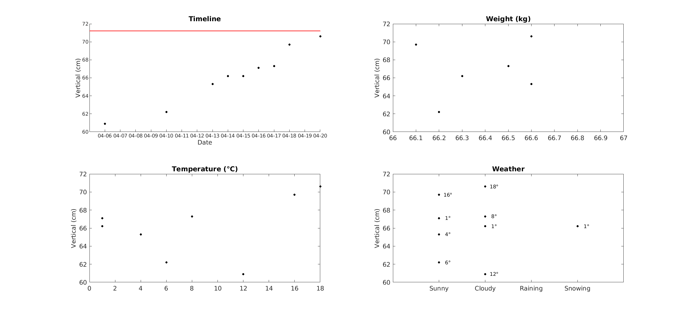
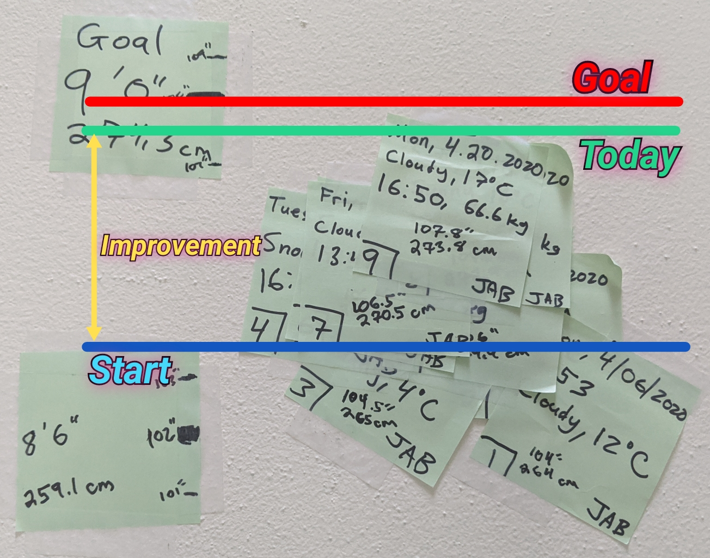
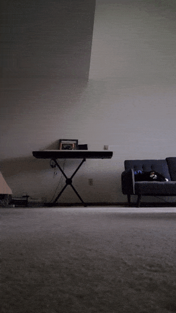
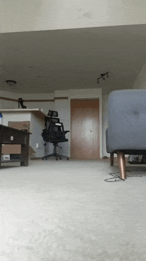

# Vertical Tracker
A database to track my progress to jump good like my hero, Samurai Jack:

## Summary
Starting on April 6, 2020 I have been tracking the highest point I can reach.

## Current Progress
Here is a visualization of my current progress

## Navigating Data
DoltHub uses a SQL interface to manipulate data. There is currently only one
table named **data**. This table currently has **10 fields**, but that may
change as I try to slim it down later on.

### Table Fields
**Measurement:** chronilogical index of when the measurement was taken  
**Date:** date of **Measurement** in *dd.mm.yyyy* format  
**Time:** time of **Measurement** in 24-hour format 
**Day:** day of week  
**Weather:** outside weather at time of **Measurement**  
**Temperature_C:** temperature of **Measurement** in *Celcius*  
**Height_cm:** my height at time of **Measurement** (constant because I'm old)  
**Stretch_cm:** my maximum outstretched height from feet to tip of fingers  
**Weight_kg:** my morning weight, tracked by my smart scale and *Feelfit* app  
**Reach_cm:** total height reached by the **Measurement**  

I am calculating the total vertical jump as  
**Vertical_cm** = (**Stretch_cm** - **Reach_cm**).

## Tracking Data
I am taking advantage of my apartment's high ceiling and measuring my jumps by
placing a Post-It note as high as I can on my loft. The Post-It note has
various information to ensure I can properly keep track of when I jumped, the
height I reached, etc.

### Setup
Here is an example of what the setup looks like:

### Example Jump
And here is a clip of one of my jumps:  

